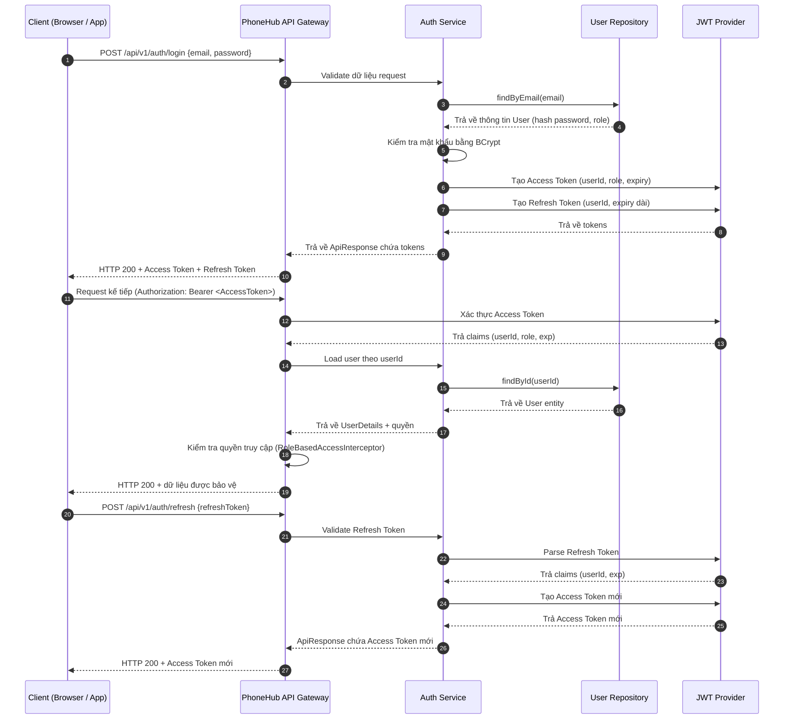
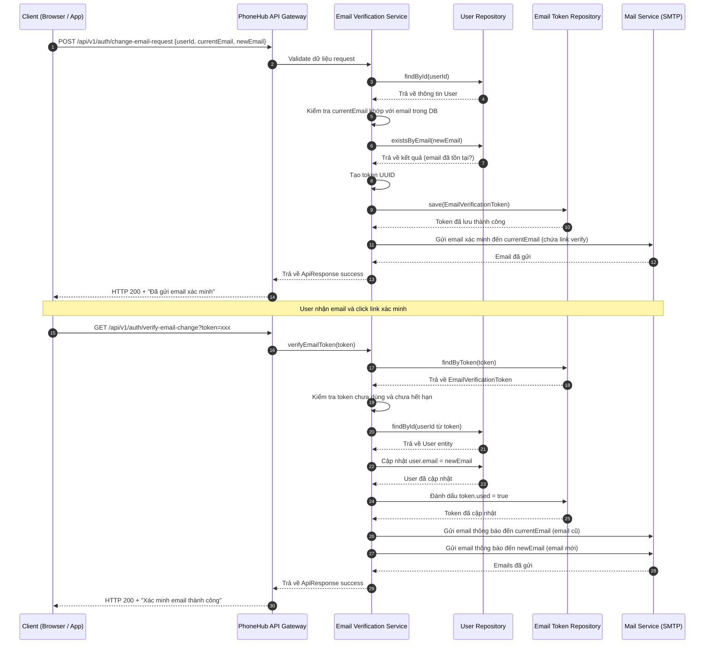
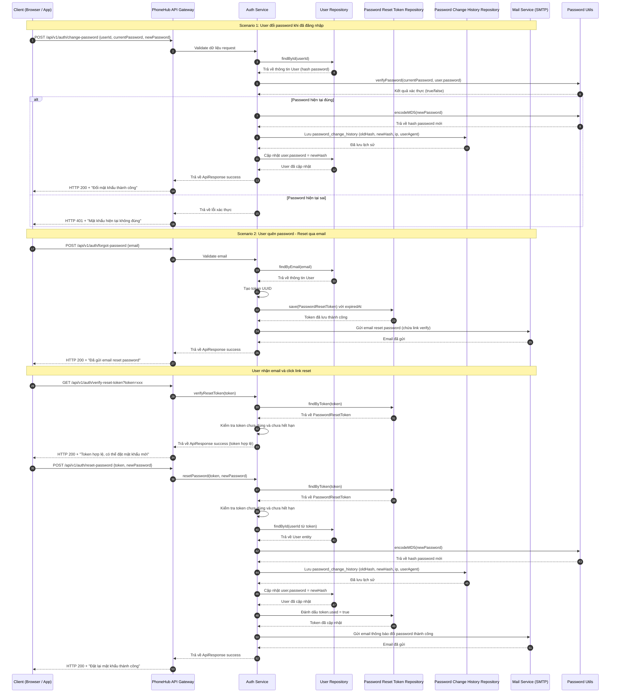

# 🚀 PhoneHub Backend

> Backend thương mại điện tử cho hệ thống PhoneHub: cung cấp REST API quản lý sản phẩm, giỏ hàng, đơn hàng, thanh toán, tích hợp Redis cache và email dịch vụ.

---

## 📖 1. Giới thiệu

- **Mục tiêu dự án**: xây dựng nền tảng backend phục vụ web/app PhoneHub, hỗ trợ quản lý danh mục sản phẩm, giỏ hàng, đơn hàng (pending/success/failed), thanh toán, xác thực người dùng, gửi email thông báo.
- **Phạm vi sử dụng**: API dành cho frontend web/mobile, dashboard admin, tích hợp đối tác thanh toán và dịch vụ nội bộ.
- **Đối tượng sử dụng**: khách hàng cuối, quản trị viên, hệ thống đối tác.
- **Liên hệ backend–frontend**: frontend (Next.js trên Vercel) tương tác qua API `https://buitanphat.site` (cấu hình CORS bằng `APP_FRONTEND_URL`), backend public tại `http://163.61.182.56:8080`.
- **Demo / Docs**:  
  `http://163.61.182.56:8080/swagger-ui/index.html`  
  GitHub repo: `https://github.com/buitanphat247/project-backend-java-phonehub`

---

## ⚙️ 2. Công nghệ & Công cụ sử dụng

| Thành phần     | Công nghệ / Phiên bản                     | Ghi chú                                        |
| -------------- | ----------------------------------------- | ---------------------------------------------- |
| Ngôn ngữ       | Java 17                                   |                                                |
| Framework      | Spring Boot 3.x                           | Spring Data JPA, Spring Security, Spring Cache |
| Cơ sở dữ liệu  | MySQL 8                                   | ORM: Hibernate (qua Spring Data JPA)           |
| Authentication | JWT                                       | Custom filter + annotation `@Public`           |
| Cache / Queue  | Redis 7 (Lettuce)                         | Cache đơn hàng success, total spent            |
| Testing        | JUnit 5, Spring Test                      | Maven Surefire                                 |
| Documentation  | Springdoc OpenAPI (Swagger UI)            | `/swagger-ui/index.html`, `/api-docs`          |
| CI/CD          | Docker, (đang mở rộng GitHub Actions)     | Build image, push Docker Hub                   |
| Deployment     | Docker Compose (local & prod), VPS Ubuntu | Hồ sơ `default`, `prod`                        |

---

## 🏗️ 3. Kiến trúc hệ thống

### 🔸 Mô hình tổng thể

- Kiến trúc **monolithic RESTful** với pattern đa tầng (layered architecture).
- Thành phần chính:
  - **API Gateway**: Spring MVC controllers.
  - **Service layer**: business logic, cache invalidation.
  - **Repository layer**: Spring Data JPA truy cập MySQL.
  - **Cache**: Redis cho danh sách orders thành công, tổng chi tiêu user, health check.
  - **External services**: Gmail SMTP, cổng thanh toán (VNPAY).
- _(Có thể bổ sung sơ đồ `docs/architecture.png` trong tương lai)._

### 🔸 Mô hình xử lý yêu cầu

1. Request tới `Controller`.
2. Controller gọi `Service` xử lý nghiệp vụ, kiểm tra quyền qua interceptors.
3. Service truy cập `Repository` (MySQL) hoặc Redis cache.
4. Kết quả được map sang `DTO` rồi trả về response chuẩn `ApiResponse`.
5. Middleware/Interceptor:
   - `PerformanceLoggingInterceptor` đo thời gian xử lý, log theo mức độ.
   - `RoleBasedAccessInterceptor` kiểm tra quyền dựa trên token, annotation.
   - Global exception handler (đang phát triển) chuẩn hóa thông báo lỗi.

---

## 📂 4. Cấu trúc thư mục

```bash
src/
 ┣ main/java/com/example/phonehub/
 ┃ ┣ auth/               # Bảo mật: filters, JWT, annotations
 ┃ ┣ config/             # Cấu hình Spring (Redis, Swagger, CORS, Security, Actuator)
 ┃ ┣ controller/         # REST controllers (Orders, Products, Auth, Redis health…)
 ┃ ┣ dto/                # DTO cho request/response
 ┃ ┣ entity/             # JPA entities
 ┃ ┣ repository/         # Spring Data repositories
 ┃ ┣ service/            # Business services và redis_cache services
 ┃ ┗ utils/              # Helper (OrderUtils, logging, constants…)
 ┣ main/resources/
 ┃ ┣ application.properties
 ┃ ┗ application-prod.properties
 ┗ test/java/...         # Unit & integration tests
docker-compose.yml
docker-compose.prod.yml
pom.xml
```

- **Thêm module mới**: tạo `entity`, `repository`, `service`, `controller`, cập nhật `dto` & Swagger docs tương ứng.

---

## 🧩 5. Cấu hình môi trường (.env)

Mẫu `.env.example` (tham khảo):

```
# Database
SPRING_DATASOURCE_URL=jdbc:mysql://localhost:3306/phonehub?useSSL=false&serverTimezone=Asia/Ho_Chi_Minh&characterEncoding=UTF-8
SPRING_DATASOURCE_USERNAME=phonehub
SPRING_DATASOURCE_PASSWORD=phonehub

# Redis
SPRING_DATA_REDIS_HOST=localhost
SPRING_DATA_REDIS_PORT=6379
SPRING_DATA_REDIS_TIMEOUT=5000ms

# JWT
JWT_SECRET=ChangeMeToARealSecret
JWT_ENVIRONMENT=development

# Mail (Gmail SMTP)
SPRING_MAIL_HOST=smtp.gmail.com
SPRING_MAIL_PORT=587
SPRING_MAIL_USERNAME=your-email@gmail.com
SPRING_MAIL_PASSWORD=app-password

# Frontend URL & Timezone
APP_FRONTEND_URL=http://localhost:3000
TZ=Asia/Ho_Chi_Minh

# Spring profile
SPRING_PROFILES_ACTIVE=default
```

> 💡 **Lưu ý**: commit `.env.example`, không commit `.env` thật. Sử dụng secret manager khi deploy.

---

## ⚡ 6. Cài đặt & Chạy dự án

1️⃣ **Clone dự án**

```bash
git clone https://github.com/<username>/phonehub-backend.git
cd phonehub-backend
```

2️⃣ **Cài đặt phụ thuộc**

```bash
mvn clean install
```

3️⃣ **Khởi tạo cơ sở dữ liệu & Redis**

- Nếu dùng Docker: `docker compose up -d db redis`
- Nếu dùng dịch vụ ngoài: tạo database `phonehub`, chạy Redis server, cập nhật `.env`

4️⃣ **Chạy dự án**

```bash
# Local với Maven
mvn spring-boot:run

# Hoặc chạy Docker Compose cho toàn bộ stack
docker compose up -d
```

- Server chạy tại `http://localhost:8080`
- Kiểm tra Redis health: `curl http://localhost:8080/api/v1/redis/health`

---

## 🧠 7. API Documentation

- Swagger UI: `http://localhost:8080/swagger-ui/index.html`
- OpenAPI JSON: `http://localhost:8080/api-docs`
- Postman collection: `scripts/phonehub.postman.json`

**Ví dụ:**

```
POST /api/v1/auth/login
Content-Type: application/json

{
  "email": "admin@example.com",
  "password": "123456"
}
```

**Response:**

```
{
  "status": "success",
  "message": "Đăng nhập thành công",
  "data": {
    "accessToken": "xxx.yyy.zzz",
    "expiresIn": 3600
  }
}
```

---

## 🧪 8. Testing

- Unit & integration tests:

```bash
mvn test
```

- Có thể cấu hình thêm:
  - `mvn -Dtest=OrderServiceTest test` để chạy từng lớp.
  - Báo cáo coverage (đang tích hợp Jacoco).

---

## ☁️ 9. Triển khai (Deployment)

### Cấu hình môi trường Production

- Sử dụng `.env.prod` hoặc biến môi trường trực tiếp trên VPS.
- Bật profile `prod`: `SPRING_PROFILES_ACTIVE=prod`.

### Dockerfile (trích)

```dockerfile
FROM eclipse-temurin:17-jdk-alpine
WORKDIR /app
COPY target/phonehub.jar app.jar
ENV TZ=Asia/Ho_Chi_Minh
EXPOSE 8080
ENTRYPOINT ["java","-jar","app.jar"]
```

### Docker Compose (prod)

```bash
docker compose -f docker-compose.prod.yml down
docker pull buitanphat2747/phonehub-app:latest
docker compose -f docker-compose.prod.yml up -d
```

### Logging & Monitoring

- Actuator `/actuator/health`, `/actuator/metrics`, `/actuator/prometheus`
- Có thể tích hợp Prometheus + Grafana, ELK stack (đang nghiên cứu).

---

## 🔐 10. Bảo mật & Quy tắc code

- Không commit thông tin nhạy cảm: mật khẩu DB, JWT secret, app password Gmail.
- Dùng HTTPS ở môi trường production, reverse proxy (Nginx) nếu cần.
- Validate input ở controller/service trước khi thao tác DB.
- Chuẩn hoá code theo `spotless-maven-plugin` (có thể bổ sung), tuân thủ chuẩn naming Java.
- Convention commit: `feat:`, `fix:`, `chore:`, `refactor:`, `docs:`, `test:`, `ci:`.

---

## 🧭 11. CI/CD Pipeline

- **Kế hoạch**: GitHub Actions build → test → build Docker → push Docker Hub → trigger deploy.
- Ví dụ workflow (`.github/workflows/ci.yml` - gợi ý):

```yaml
name: CI
on:
  push:
    branches: [main, develop]
jobs:
  build:
    runs-on: ubuntu-latest
    steps:
      - uses: actions/checkout@v3
      - uses: actions/setup-java@v3
        with:
          distribution: temurin
          java-version: "17"
      - run: mvn -B clean verify
      - run: docker build -t phonehub-app:${{ github.sha }} .
```

- Triển khai tự động: cập nhật VPS script để pull image mới và restart dịch vụ.

---

## 🤝 12. Đóng góp (Contribution Guide)

1. Fork repository.
2. Tạo branch mới: `feature/<ten-chuc-nang>` hoặc `fix/<ten-bug>`.
3. Commit theo convention, push branch.
4. Tạo Pull Request, mô tả thay đổi, gắn issue liên quan.
5. Yêu cầu review trước khi merge vào `develop`/`main`.

---

## 🧑‍💻 13. Thành viên & Liên hệ

| Tên           | Vai trò          | Liên hệ                                                                        |
| ------------- | ---------------- | ------------------------------------------------------------------------------ |
| Bùi Tấn Phát  | Backend Engineer | tan270407@gmail.com · 0984 380 205 · [Facebook](https://facebook.com/btanphat) |
| PhoneHub Team | Product / DevOps | https://buitanphat.site                                                        |

---

## 📄 14. License

- Giấy phép: _đang cập nhật_ (đề xuất MIT hoặc Proprietary tùy chính sách).

---

## 📚 15. Phụ lục

- ### Sơ đồ quan hệ (DBML)

```dbml
//////////////////////////////////////////////////
// 🧩 PHÂN QUYỀN NGƯỜI DÙNG
//////////////////////////////////////////////////

Table roles {
  id int [pk, increment]
  name varchar(50) [unique, not null]
  created_at timestamp [default: `CURRENT_TIMESTAMP`]
  updated_at timestamp [default: `CURRENT_TIMESTAMP ON UPDATE CURRENT_TIMESTAMP`]
}

Table users {
  id int [pk, increment]
  username varchar(50) [unique, not null]
  password varchar(255) [not null]
  email varchar(100) [unique]
  phone varchar(20)
  address varchar(255)
  avatar varchar(255)
  birthday date
  points int [default: 0]
  rank_id int [ref: > user_ranks.id]
  refresh_token varchar(255)
  role_id int [ref: > roles.id]
  created_at timestamp [default: `CURRENT_TIMESTAMP`]
  updated_at timestamp [default: `CURRENT_TIMESTAMP ON UPDATE CURRENT_TIMESTAMP`]
}

//////////////////////////////////////////////////
// 🏆 XẾP HẠNG NGƯỜI DÙNG
//////////////////////////////////////////////////

Table user_ranks {
  id int [pk, increment]
  name varchar(100) [unique, not null]
  min_points int [not null]
  max_points int [not null]
  discount decimal(5,2) [default: 0.00, not null]
  created_at timestamp [default: `CURRENT_TIMESTAMP`]
  updated_at timestamp [default: `CURRENT_TIMESTAMP ON UPDATE CURRENT_TIMESTAMP`]
}

//////////////////////////////////////////////////
// 📧 XÁC THỰC EMAIL
//////////////////////////////////////////////////

Table email_verification_tokens {
  id int [pk, increment]
  user_id int [ref: > users.id]
  current_email varchar(255) [not null]
  new_email varchar(255) [not null]
  token varchar(255) [unique, not null]
  used boolean [default: false, not null]
  created_at timestamp [default: `CURRENT_TIMESTAMP`]
  updated_at timestamp [default: `CURRENT_TIMESTAMP ON UPDATE CURRENT_TIMESTAMP`]
}

//////////////////////////////////////////////////
// 🛒 HỆ THỐNG SẢN PHẨM
//////////////////////////////////////////////////

Table categories {
  id int [pk, increment]
  name varchar(100) [unique, not null]
  slug varchar(150) [unique, not null]
  created_by int [ref: > users.id]
  created_at timestamp [default: `CURRENT_TIMESTAMP`]
  updated_at timestamp [default: `CURRENT_TIMESTAMP ON UPDATE CURRENT_TIMESTAMP`]
}

Table products {
  id int [pk, increment]
  name varchar(255) [not null]
  slug varchar(255) [unique, not null]
  brand varchar(100) [not null]
  category_id int [ref: > categories.id]
  price decimal(15,2)
  price_old decimal(15,2)
  discount varchar(20)
  thumbnail_image varchar(500)
  is_published boolean [default: false]
  published_at timestamp
  created_by int [ref: > users.id]
  created_at timestamp [default: `CURRENT_TIMESTAMP`]
  updated_at timestamp [default: `CURRENT_TIMESTAMP ON UPDATE CURRENT_TIMESTAMP`]
}

Table product_specifications {
  id int [pk, increment]
  product_id int [ref: > products.id]
  group_name varchar(100) [not null]
  label varchar(255) [not null]
  value text
  type varchar(20) [not null]
  created_by int [ref: > users.id]
  created_at timestamp [default: `CURRENT_TIMESTAMP`]
  updated_at timestamp [default: `CURRENT_TIMESTAMP ON UPDATE CURRENT_TIMESTAMP`]
}

Table product_colors {
  id int [pk, increment]
  product_id int [ref: > products.id]
  name varchar(50) [not null]
  hex_color varchar(10)
  created_by int [ref: > users.id]
  created_at timestamp [default: `CURRENT_TIMESTAMP`]
  updated_at timestamp [default: `CURRENT_TIMESTAMP ON UPDATE CURRENT_TIMESTAMP`]
}

Table product_images {
  id int [pk, increment]
  product_id int [ref: > products.id]
  url varchar(500) [not null]
  created_by int [ref: > users.id]
  created_at timestamp [default: `CURRENT_TIMESTAMP`]
  updated_at timestamp [default: `CURRENT_TIMESTAMP ON UPDATE CURRENT_TIMESTAMP`]
}

//////////////////////////////////////////////////
// ⭐ ĐÁNH GIÁ SẢN PHẨM
//////////////////////////////////////////////////

Table product_reviews {
  id int [pk, increment]
  order_id int [ref: > orders.id]
  product_id int [ref: > products.id]
  user_id int [ref: > users.id]
  rating int [not null]
  comment text
  created_at timestamp [default: `CURRENT_TIMESTAMP`]
  updated_at timestamp [default: `CURRENT_TIMESTAMP ON UPDATE CURRENT_TIMESTAMP`]
}

//////////////////////////////////////////////////
// ❤️ DANH SÁCH YÊU THÍCH
//////////////////////////////////////////////////

Table product_favorites {
  id int [pk, increment]
  user_id int [ref: > users.id]
  product_id int [ref: > products.id]
  created_at timestamp [default: `CURRENT_TIMESTAMP`]
  Indexes {
    (user_id, product_id) [unique]
  }
}

//////////////////////////////////////////////////
// 🔐 PASSWORD RESET TOKEN
//////////////////////////////////////////////////

Table password_reset_tokens {
  id int [pk, increment]
  user_id int [ref: > users.id]
  email varchar(255) [not null]
  token varchar(255) [unique, not null]
  expired_at timestamp [not null]
  used boolean [default: false, not null]
  created_at timestamp [default: `CURRENT_TIMESTAMP`]
  updated_at timestamp [default: `CURRENT_TIMESTAMP ON UPDATE CURRENT_TIMESTAMP`]
}

//////////////////////////////////////////////////
// 📜 PASSWORD CHANGE HISTORY
//////////////////////////////////////////////////

Table password_change_history {
  id int [pk, increment]
  user_id int [ref: > users.id]
  old_password_hash varchar(255) [not null]
  new_password_hash varchar(255) [not null]
  ip_address varchar(50)
  user_agent varchar(255)
  created_at timestamp [default: `CURRENT_TIMESTAMP`]
}

//////////////////////////////////////////////////
// 🛒 GIỎ HÀNG
//////////////////////////////////////////////////

Table cart_items {
  id int [pk, increment]
  user_id int [ref: > users.id]
  product_id int [ref: > products.id]
  quantity int [default: 1, not null]
  price_at_add decimal(15,2) [not null]
  created_at timestamp [default: `CURRENT_TIMESTAMP`]
  updated_at timestamp [default: `CURRENT_TIMESTAMP ON UPDATE CURRENT_TIMESTAMP`]
  Indexes {
    (user_id, product_id) [unique]
  }
}

//////////////////////////////////////////////////
// 🧾 ĐƠN HÀNG
//////////////////////////////////////////////////

Table orders {
  id int [pk, increment]
  user_id int [ref: > users.id, null]
  buyer_name varchar(100) [not null]
  buyer_email varchar(100)
  buyer_phone varchar(20)
  buyer_address varchar(255)
  total_price decimal(15,2) [not null]
  payment_method varchar(50) [default: 'COD']
  status enum('success', 'failed') [default: 'success']
  note varchar(255)
  created_at timestamp [default: `CURRENT_TIMESTAMP`]
  updated_at timestamp [default: `CURRENT_TIMESTAMP ON UPDATE CURRENT_TIMESTAMP`]
}

//////////////////////////////////////////////////
// 🧾 CHI TIẾT ĐƠN HÀNG
//////////////////////////////////////////////////

Table order_items {
  id int [pk, increment]
  order_id int [ref: > orders.id]
  product_id int [ref: > products.id]
  quantity int [not null]
  unit_price decimal(15,2) [not null]
  is_reviewed boolean [default: false, not null]
  review_id int [ref: > product_reviews.id, null]
  created_at timestamp [default: `CURRENT_TIMESTAMP`]
}
```

- ### Sơ đồ quan hệ (ERD Diagram)

```mermaid
erDiagram
    roles ||--o{ users : "has"
    user_ranks ||--o{ users : "has"
    users ||--o{ email_verification_tokens : "has"
    users ||--o{ password_reset_tokens : "has"
    users ||--o{ password_change_history : "has"
    users ||--o{ categories : "creates"
    users ||--o{ products : "creates"
    users ||--o{ product_specifications : "creates"
    users ||--o{ product_colors : "creates"
    users ||--o{ product_images : "creates"
    users ||--o{ product_reviews : "writes"
    users ||--o{ product_favorites : "has"
    users ||--o{ cart_items : "has"
    users ||--o{ orders : "places"
    categories ||--o{ products : "contains"
    products ||--o{ product_specifications : "has"
    products ||--o{ product_colors : "has"
    products ||--o{ product_images : "has"
    products ||--o{ product_reviews : "receives"
    products ||--o{ product_favorites : "in"
    products ||--o{ cart_items : "in"
    products ||--o{ order_items : "in"
    orders ||--o{ order_items : "contains"
    orders ||--o{ product_reviews : "generates"
    product_reviews ||--o{ order_items : "linked_to"

    roles {
        int id PK
        varchar name UK
        timestamp created_at
        timestamp updated_at
    }

    users {
        int id PK
        varchar username UK
        varchar password
        varchar email UK
        varchar phone
        varchar address
        varchar avatar
        date birthday
        int points
        int rank_id FK
        varchar refresh_token
        int role_id FK
        timestamp created_at
        timestamp updated_at
    }

    user_ranks {
        int id PK
        varchar name UK
        int min_points
        int max_points
        decimal discount
        timestamp created_at
        timestamp updated_at
    }

    email_verification_tokens {
        int id PK
        int user_id FK
        varchar current_email
        varchar new_email
        varchar token UK
        boolean used
        timestamp created_at
        timestamp updated_at
    }

    password_reset_tokens {
        int id PK
        int user_id FK
        varchar email
        varchar token UK
        timestamp expired_at
        boolean used
        timestamp created_at
        timestamp updated_at
    }

    password_change_history {
        int id PK
        int user_id FK
        varchar old_password_hash
        varchar new_password_hash
        varchar ip_address
        varchar user_agent
        timestamp created_at
    }

    categories {
        int id PK
        varchar name UK
        varchar slug UK
        int created_by FK
        timestamp created_at
        timestamp updated_at
    }

    products {
        int id PK
        varchar name
        varchar slug UK
        varchar brand
        int category_id FK
        decimal price
        decimal price_old
        varchar discount
        varchar thumbnail_image
        boolean is_published
        timestamp published_at
        int created_by FK
        timestamp created_at
        timestamp updated_at
    }

    product_specifications {
        int id PK
        int product_id FK
        varchar group_name
        varchar label
        text value
        varchar type
        int created_by FK
        timestamp created_at
        timestamp updated_at
    }

    product_colors {
        int id PK
        int product_id FK
        varchar name
        varchar hex_color
        int created_by FK
        timestamp created_at
        timestamp updated_at
    }

    product_images {
        int id PK
        int product_id FK
        varchar url
        int created_by FK
        timestamp created_at
        timestamp updated_at
    }

    product_reviews {
        int id PK
        int order_id FK
        int product_id FK
        int user_id FK
        int rating
        text comment
        timestamp created_at
        timestamp updated_at
    }

    product_favorites {
        int id PK
        int user_id FK
        int product_id FK
        timestamp created_at
    }

    cart_items {
        int id PK
        int user_id FK
        int product_id FK
        int quantity
        decimal price_at_add
        timestamp created_at
        timestamp updated_at
    }

    orders {
        int id PK
        int user_id FK
        varchar buyer_name
        varchar buyer_email
        varchar buyer_phone
        varchar buyer_address
        decimal total_price
        varchar payment_method
        enum status
        varchar note
        timestamp created_at
        timestamp updated_at
    }

    order_items {
        int id PK
        int order_id FK
        int product_id FK
        int quantity
        decimal unit_price
        boolean is_reviewed
        int review_id FK
        timestamp created_at
    }
```



- ### Sơ đồ luồng JWT Authentication (Flowchart)



- ### Sơ đồ luồng Change Email (Flowchart)



- ### Sơ đồ luồng Change Password (Flowchart)



- Sơ đồ ERD: `docs/erd.png` _(đang bổ sung)_.
- Sơ đồ sequence cho flow Checkout: `docs/sequence-checkout.png`.
- Mẫu response chuẩn: xem `ApiResponse`.
- Lệnh tiện ích:
  - `docker exec phonehub-db mysql -u phonehub -pphonehub phonehub -e "SELECT COUNT(*) FROM cart_items;"` (đếm cart items).
  - `docker compose -f docker-compose.prod.yml logs -f app` (theo dõi log backend).

---

> Mọi góp ý/issue xin gửi qua GitHub Issues hoặc email đội ngũ PhoneHub.
